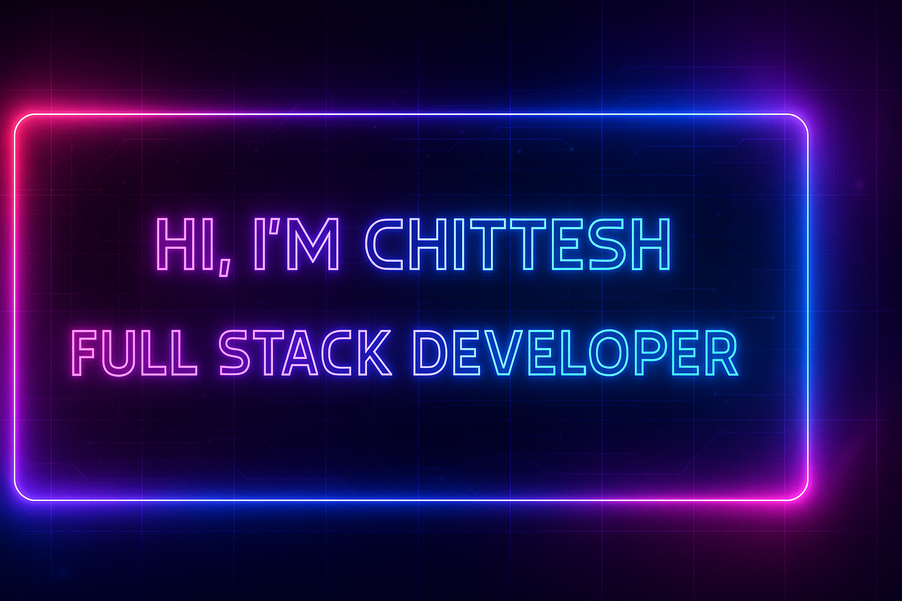

<!-- ──────────────────────────────────────────────────────────────── -->
<!--                          NEON BANNER                             -->
<!-- ──────────────────────────────────────────────────────────────── -->

  <!-- Make sure ./assets/banner.png exists in your repo (commit the file). -->
  

<!-- Typing Intro
     NOTE: Some free services (Heroku) that host the typing-svg go down.
     If the image doesn't load, the plain text line below will still show. -->

  

  <strong>Full Stack Developer crafting modern, scalable, and user-centric digital experiences.</strong>

<!-- Badges -->

  
  
  

---

## 🚀 About Me

- 🌟 Full Stack Developer passionate about building impactful digital products  
- 💡 I love experimenting with new tech, design systems, and system architectures  
- 🤝 Open to collaborating on exciting full-stack, mobile, and AI projects  
- 🎯 Currently improving my problem-solving and system design skills  

---

## 🧠 Tech Stack

### 💻 Languages  

  
  
  
  
  

### 🧩 Frameworks & Libraries  

  
  
  
  
  
  

### 🛠 Tools & Platforms  

  
  
  
  
  
  
  

---

## 📊 GitHub Stats

  
  

  

## 🏆 Achievements

  

---

## 🏆 Achievements

  

---

## 📂 Featured Project

### 🔥 Lost and Found App  
**Tech Stack:** Flutter, Next.js, Express  
📍 **GitHub:** https://github.com/Chittesh249/Lost-and-found  

🔸 *A smart lost-and-found platform that allows users to report, search, and recover lost items seamlessly.*

---

## 🌐 Connect With Me

  
  

---

✨ Thanks for visiting my profile! Drop a ⭐ on repositories you like!

